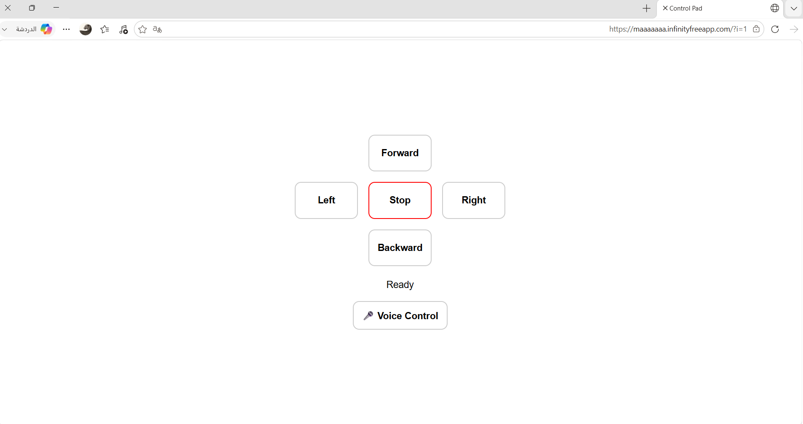
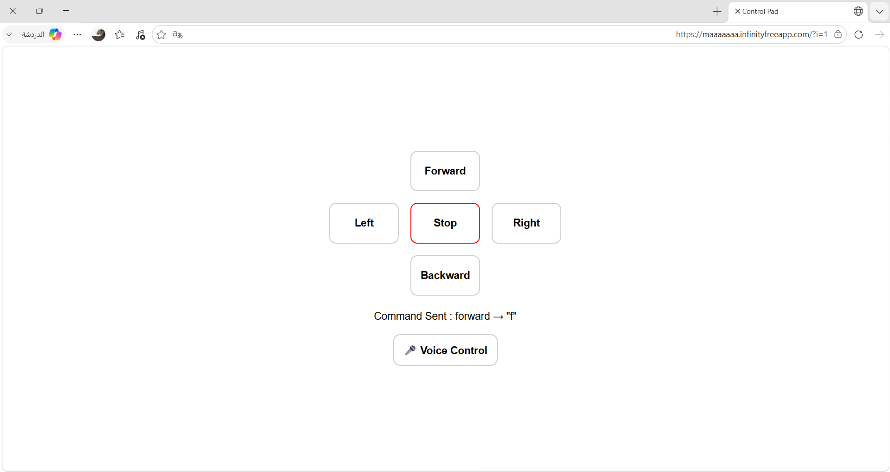
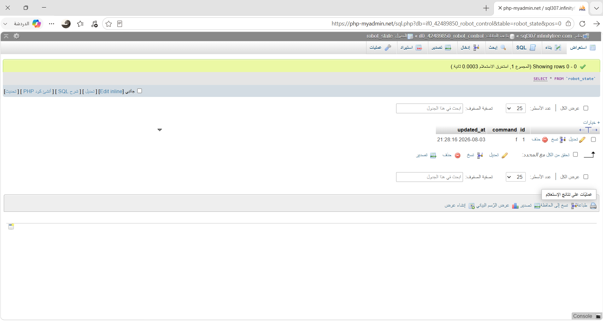

# 🤖Robot-Control-System

## Robot Control Panel with Voice Commands

A web-based robot control panel that allows users to send robot movement commands using both **buttons** and **voice commands**. 🎤

The commands are stored in a MySQL database and can be retrieved through PHP.

---
## ✨ Features
- 🎮 Button-based robot control
- 🎤 Voice control using Speech Recognition
- ⬆️ Forward
- ⬇️ Backward
- ⬅️ Left
- ➡️ Right
- 🛑 Stop
- 🗄️ MySQL database for storing commands
- 🔄 Retrieve the latest robot state
- 🌐 Hosted on InfinityFree

---

## 🛠️ Technologies Used
- HTML
- CSS
- JavaScript
- PHP
- MySQL
- Web Speech API
- InfinityFree

---

## 🎮 How It Works
The user can control the robot in two ways:

###  Using Buttons
Clicking any movement button sends the selected command to the PHP backend, which updates the `robot_state` table in the database.

### 🎤 Using Voice Commands
The user can click **Voice Control** and say one of the supported commands:

`Forward` • `Backward` • `Left` • `Right` • `Stop`

The browser converts the speech into text, then sends the recognized command to the same backend used by the control buttons.

---

## 🗄️ Database Commands
| 🎮 Command | 💾 Stored Value |
|---|---|
| ⬆️ Forward | `f` |
| ⬇️ Backward | `b` |
| ⬅️ Left | `l` |
| ➡️ Right | `r` |
| 🛑 Stop | `S` |

Only one row is used in the `robot_state` table, and each new command updates the existing row instead of creating a new one.

---

## 📁 Project Files

- `index.html` —  Control panel and voice control
- `db.php` —  Database connection
- `update_command.php` —  Updates the robot command
- `get_state.php` —  Retrieves the latest command
- `setup.sql` — 

 Creates and initializes the database table

---
## 🖼️ Screenshots

### 🎮 Control Panel

### 🎤 Voice Control

### 🗄️ Database

---
## 🎥 Demo Video

[▶️ Watch the Demo Video]([رابط-الدرايف-هنا](https://drive.google.com/file/d/1RehRVgaXw_BGaRWwcL77Wo2f2SG2ar1x/view?usp=sharing)

---

## 🚀 Deployment
The project is deployed using **InfinityFree** with a MySQL database.

🤖🎤 **Robot Control Panel — Button & Voice Control**
